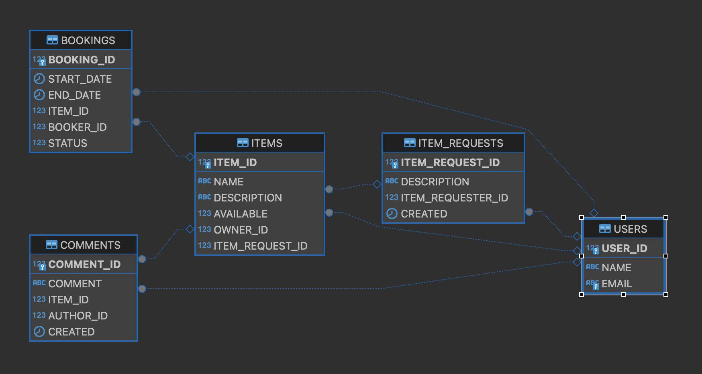

# Реализация проекта ShareIt
##### Бэкенд сервиса для шеринга вещей, позволяющий осуществлять поиск и бронирование необходимой вещи, писать отзывы, а так же создавать запросы для получения нужной вещи.
##### Использовались технологии: Spring Boot, REST, Lombok, Hibernate, PostgreSQL, Микросервисы, Docker.
### Развёртывание проекта
1. Проект выполнен на Amazon Coretto JDK 11; версия Spring Boot 2.7.18.
2. На компьютере, где планируется использовать проект, должен быть установлен Docker.
3. Для развёртывания проекта перейдите в терминале в папку проекта, и наберите команду "docker-compose up".

### Схема базы данных

###  Описание таблиц базы данных
##### Users - содержит информацию о пользователях сервиса
| № | Column Name | Description      | Type    | Key | Reference |
|---|-------------|------------------|---------|-----|-----------|
| 1 | User_id     | Identifier       | integer | PK  |           |
| 2 | Name        | Name             | varchar |     |           |
| 3 | Email       | Email            | varchar |     |           |
---
##### Items - содержит информацию о пользователях сервиса
| № | Column Name    | Description             | Type    | Key | Reference    |
|---|----------------|-------------------------|---------|-----|--------------|
| 1 | Item_id        | Identifier              | integer | PK  |              |
| 2 | Name           | Item name               | varchar |     |              |
| 3 | Description    | Description             | varchar |     |              |
| 4 | Available      | Availability            | integer |     |              |
| 5 | Owner_id       | Owner Identifier        | integer | FK  | Users        |
| 6 | ItemRequest_id | Item request Identifier | integer | FK  | ItemRequests |
---
##### Bookings - содержит информацию о бронированиях вещей
| № | Column Name | Description       | Type    | Key | Reference |
|---|-------------|-------------------|---------|-----|-----------|
| 1 | Booking_id  | Identifier        | integer | PK  |           |
| 2 | StartDate   | Start of booking  | date    |     |           |
| 3 | EndDate     | End of booking    | date    |     |           |
| 4 | Item_id     | Item Identifier   | integer | FK  | Items     |
| 5 | Booker_id   | Booker Identifier | integer | FK  | Users     |
| 6 | Status      | Booking Status    | integer |     |           |
---
##### Comments - содержит комментарии по завершённым бронированиям
| № | Column Name | Description       | Type    | Key | Reference |
|---|-------------|-------------------|---------|-----|-----------|
| 1 | Comment_id  | Identifier        | integer | PK  |           |
| 2 | Comment     | Comment           | varchar |     |           |
| 3 | Item_id     | Item Identifier   | integer | FK  | Items     |
| 4 | Author_id   | Author Identifier | integer | FK  | Users     |
| 5 | Created     | Date of creation  | date    |     |           |
---
##### ItemRequests - содержит запросы на вещи, не представленные в сервисе
| № | Column Name      | Description              | Type    | Key | Reference |
|---|------------------|--------------------------|---------|-----|-----------|
| 1 | ItemRequest_id   | Identifier               | integer | PK  |           |
| 2 | Description      | Description              | varchar |     |           |
| 3 | ItemRequester_id | ItemRequester Identifier | integer | FK  | Users     |
| 4 | Created          | Date of creation         | date    |     |           |
---